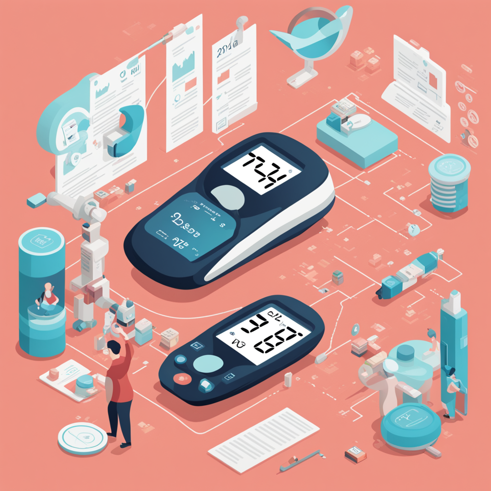
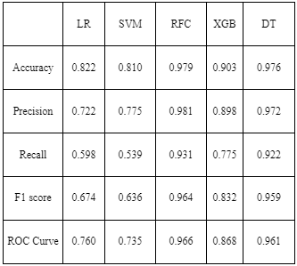
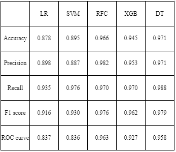

# Diabetes Prediction Project

## Overview

This project focuses on predicting the likelihood of diabetes using machine learning models. Leveraging two distinct datasets, clinical and non-clinical, we aim to enhance the accuracy of our predictions.

## Datasets

We have seen two major datasets where we have done both preprocessing and cleaning, so the PIMA dataset showed more promise in terms of our research as it contains clinical factors. The dataset has the following parameters: Pregnancy, Glucose, BloodPressure, SkinThickness, Insulin, BMI and DiabetesPedigreeFunction(family history). All these focus on the clinical factors of the problem and give a more understandable reason for the direct impact on being diabetic or not. The dataset was numerical with few categorical parameters that needed our attention. The other dataset which we saw contained various non-clinical factors as well hence we also had to consider using it for concluding the effect of such factors on whether a patient is diabetic or not. This dataset has the following parameters: Family_diabetic, PhysicallyActive, smoking, alcohol, BMI, Sleep, SoundSleep, JunkFood, Stress, Pregnancies and more. It is more inclined towards the non-clinical factors hence it gives an indirect impact on diabetes. More so, these habits lead to the change in clinical factors. Eating more junk food and not exercising can increase the chances of being diabetic as the blood sugar level can turn inappropriate for people in the age of 40 onwards

## Models

Our project explores several machine learning models to predict diabetes:

- **Logistic Regression**
- **Random Forest Classifier**
- **Support Vector Machine (SVM)**
- **Decision Tree**
- **Gradient Boosting Classifier**
  
## Model Evaluation Methods Used

Our models have been evaluated using various metrics:

- **Accuracy**
- **Precision**
- **Recall**
- **F1-Score**
- **ROC Curve**
- **Confusion Matrix**
    
## Results

Following image shows how the models have been evaluated using various metrics on the clinical dataset:

Following image shows how the models have been evaluated using various metrics on the clinical dataset:

